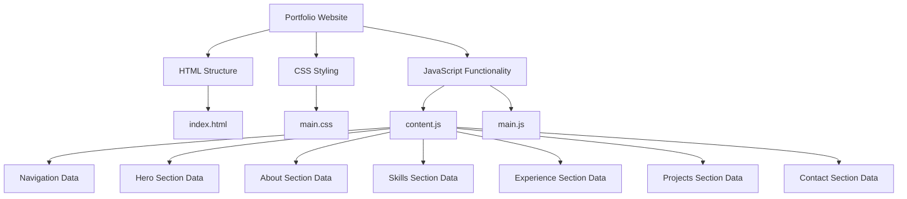
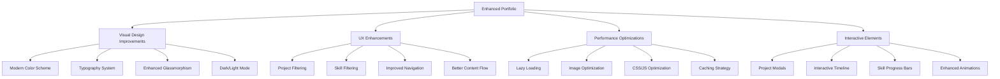
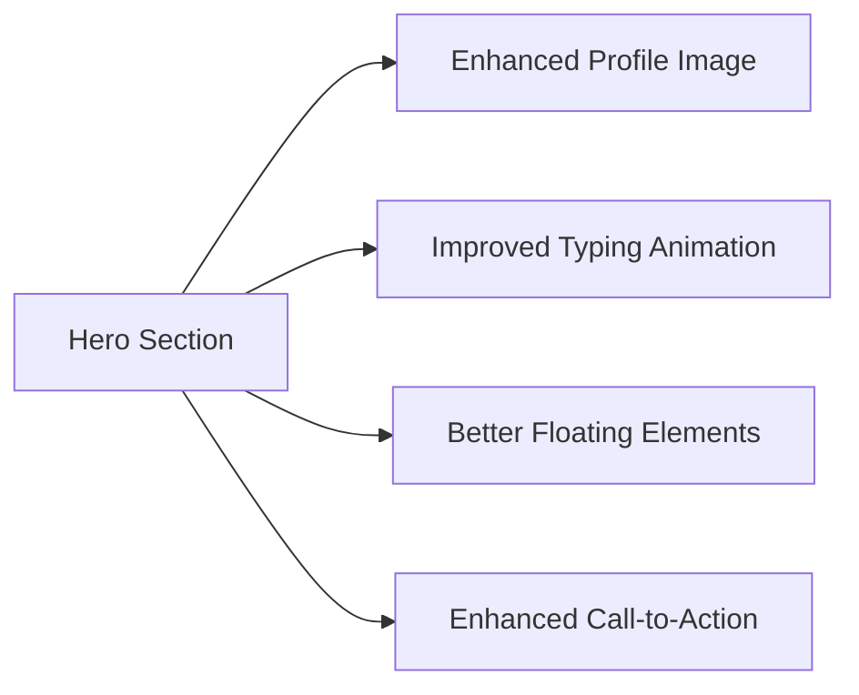
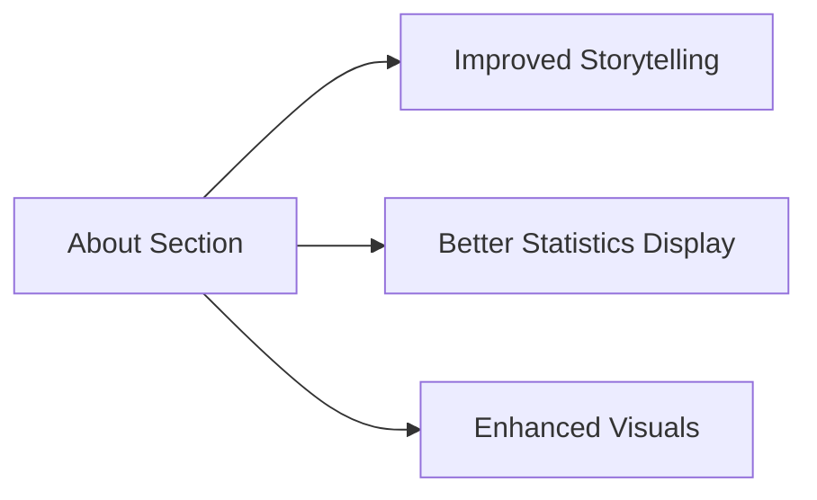
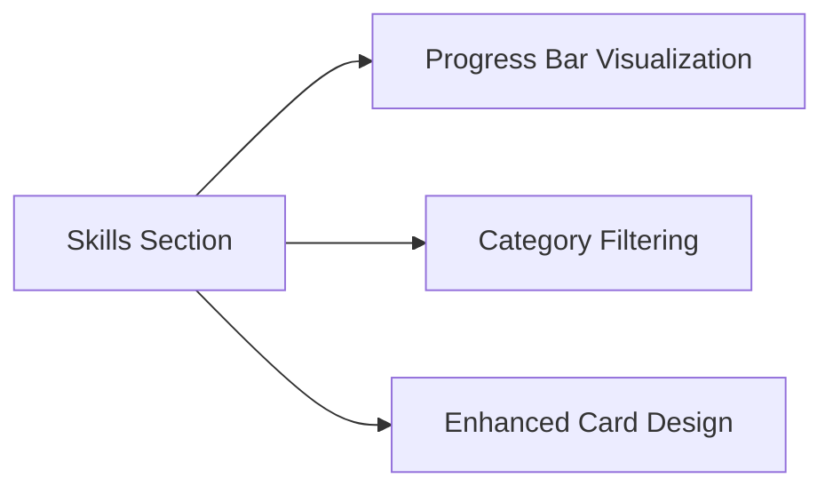
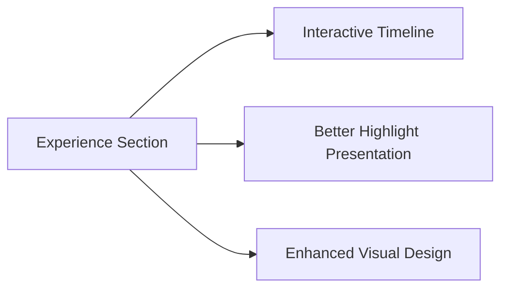
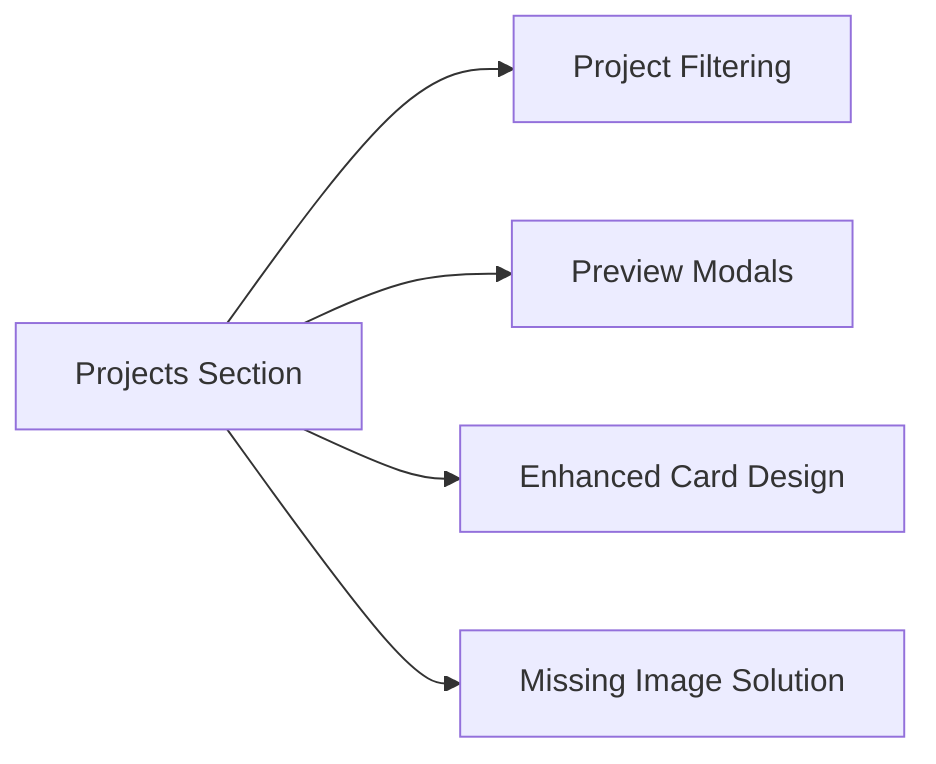
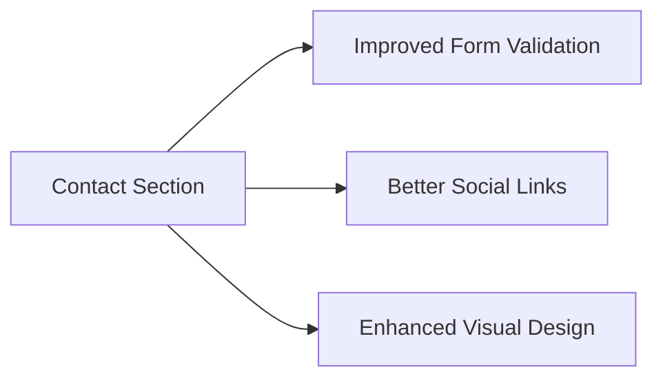

# Portfolio Website Architecture Plan

## Current Structure Overview



## Proposed Improvements Architecture



## Section-by-Section Improvements

### Hero Section


### About Section


### Skills Section


### Experience Section


### Projects Section


### Contact Section


## Technical Implementation Plan

```mermaid
graph TD
    T[Technical Implementation] --> T1[CSS Enhancements]
    T --> T2[JavaScript Improvements]
    T --> T3[Performance Optimizations]
    T --> T4[Responsive Design]
    
    T1 --> T1A[Modern Gradients]
    T1 --> T1B[Enhanced Animations]
    T1 --> T1C[Better Typography]
    T1 --> T1D[Dark Mode Support]
    
    T2 --> T2A[Filtering Functionality]
    T2 --> T2B[Modal Implementation]
    T2 --> T2C[Enhanced Interactions]
    T2 --> T2D[Improved Data Handling]
    
    T3 --> T3A[Lazy Loading]
    T3 --> T3B[Image Optimization]
    T3 --> T3C[Code Splitting]
    T3 --> T3D[Caching Strategy]
    
    T4 --> T4A[Mobile Navigation]
    T4 --> T4B[Touch Optimization]
    T4 --> T4C[Cross-browser Support]
    T4 --> T4D[Accessibility Improvements]